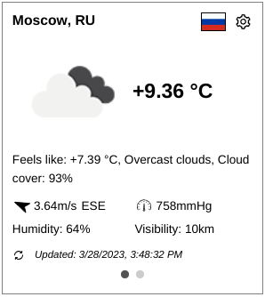
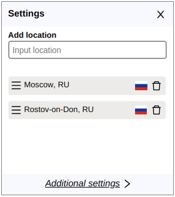
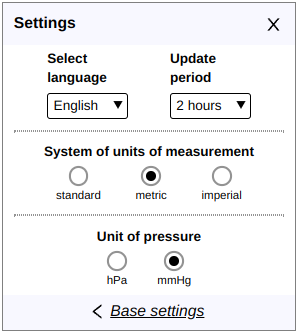

<p align="center">
    
    
    
</p>
<p align="center">
    <a href="https://weather-widget-alpha.vercel.app">Online demo</a>
</p>

>Type the full name of the location (city) to search for it. Then select the necessary location (city) from the dropdown list.  
>Sorry, API can search only full name of location (city).
---
### Environment variables in .env file

> **API_URL** - http://api.openweathermap.org/data/2.5  
> **API_KEY** - you personal key from [free public API](http://api.openweathermap.org)  
> If you plan to use this: get your [own API key](https://openweathermap.org/appid#get) from OpenWeatherMap and replace the key in `.env`
---    
### Project Setup

```sh
npm install
```

### Compile and Hot-Reload for Development

```sh
npm run serve
```

### Compile and Minify for Production

```sh
npm run build
```

### Lint with [ESLint](https://eslint.org/)

```sh
npm run lint
```
